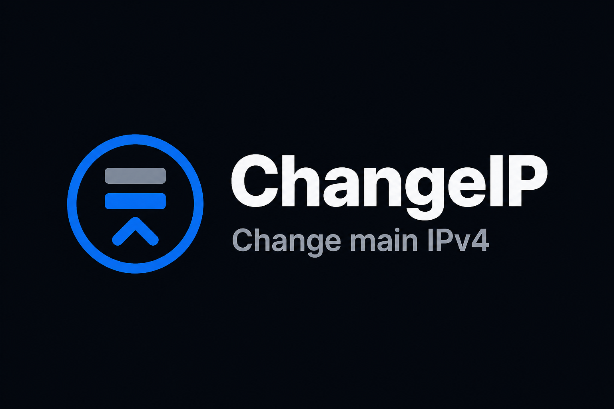

<h1 align="center">ChangeIP</h1>
<p align="center"></p>

<h1 align="center">English</h1>

ChangeIP sets the provider-assigned IPv4 address as the explicit source address for the Linux server's default route.

Existing primary IPv4, IPv6, firewall, Docker, and provider configurations remain unchanged. ChangeIP does not reboot the server.

## Installation

```bash
curl -fsSL https://raw.githubusercontent.com/ReeA11/change-ip/master/install-en.sh | sudo sh
```

## Update

```bash
sudo change-ip update
```

```bash
curl -fsSL https://raw.githubusercontent.com/ReeA11/change-ip/master/update.sh | sudo sh
```

## Usage

```bash
sudo change-ip
sudo change-ip 176.96.136.246/25 --gateway 176.96.136.129 --interface eth0
sudo change-ip --dry-run 176.96.136.246/25 --gateway 176.96.136.129
sudo change-ip status
sudo change-ip doctor
sudo change-ip rollback
sudo change-ip update
```

Supported flags include `--prefix`, `--profile`, `--runtime-only`, `--yes`, `--check-egress`, `--verbose`, as well as the legacy CLI positional interface argument. A prefix is ​​mandatory for the new address; ChangeIP does not attempt to guess it. Profile format:

```text
# IP/PREFIX          GATEWAY
176.96.136.246/25    176.96.136.129
```

<h1 align="center">Русский</h1>

ChangeIP делает выданный провайдером IPv4 явным source-адресом default route Linux-сервера.

Существующие IPv4 сохраняются; IPv6, firewall, Docker и provider configuration не изменяются. ChangeIP не перезагружает сервер.

## Установка

```bash
curl -fsSL https://raw.githubusercontent.com/ReeA11/change-ip/master/install-ru.sh | sudo sh
```

## Обновление

```bash
sudo change-ip update
```

```bash
curl -fsSL https://raw.githubusercontent.com/ReeA11/change-ip/master/update.sh | sudo sh
```

## Использование

```bash
sudo change-ip
sudo change-ip 176.96.136.246/25 --gateway 176.96.136.129 --interface eth0
sudo change-ip --dry-run 176.96.136.246/25 --gateway 176.96.136.129
sudo change-ip status
sudo change-ip doctor
sudo change-ip rollback
sudo change-ip update
```

Поддерживаются `--prefix`, `--profile`, `--runtime-only`, `--yes`, `--check-egress`, `--verbose` и positional interface старого CLI. Для нового адреса prefix обязателен: ChangeIP его не угадывает. Формат profile:

```text
# IP/PREFIX          GATEWAY
176.96.136.246/25    176.96.136.129
```
