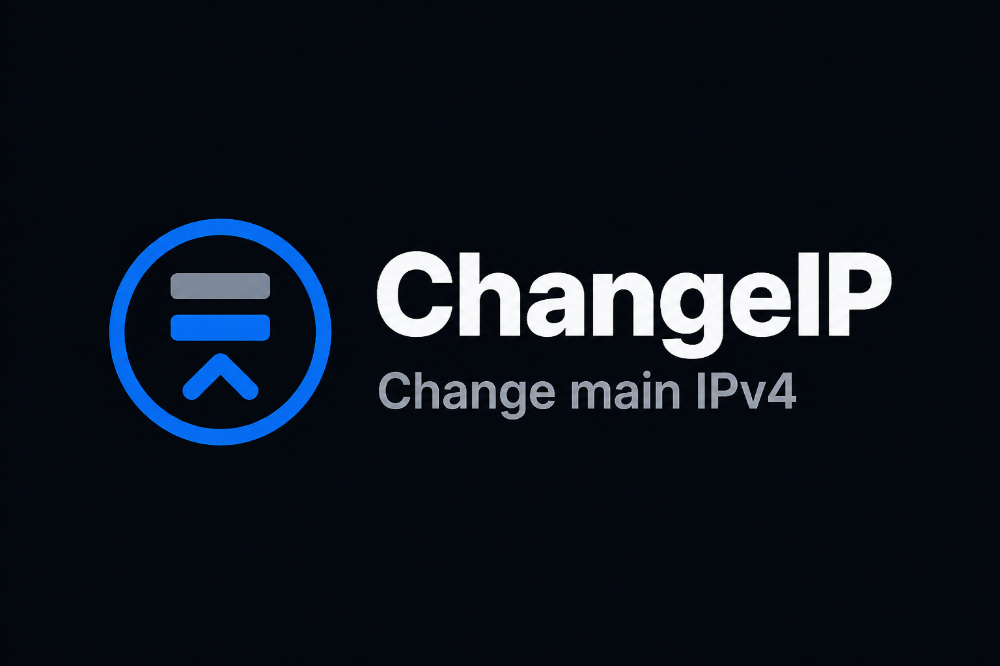

<h1 align="center">ChangeIP</h1>
<p align="center"></p>

<h1 align="center">English</h1>

ChangeIP sets the provider-assigned IPv4 address as the explicit source address for the Linux server's default route.

Existing primary IPv4, IPv6, firewall, Docker, and provider configurations remain unchanged. ChangeIP does not reboot the server.

## Installation

```bash
curl -fsSL https://raw.githubusercontent.com/ReeA11/change-ip/master/install-en.sh | sudo sh
```

## Update

```bash
sudo change-ip update
```

```bash
curl -fsSL https://raw.githubusercontent.com/ReeA11/change-ip/master/update.sh | sudo sh
```

## Usage

```bash
sudo change-ip
sudo change-ip 176.96.136.246/25 --gateway 176.96.136.129 --interface eth0
sudo change-ip --dry-run 176.96.136.246/25 --gateway 176.96.136.129
sudo change-ip status
sudo change-ip doctor
sudo change-ip rollback
sudo change-ip update
```

- `sudo change-ip add-address 176.96.136.247/25 176.96.136.248/25 --interface eth0` — add IPv4 addresses without changing the outbound IP.
- `sudo change-ip set-gateway 176.96.136.129 --interface eth0 --source 176.96.136.246` — change the gateway and bind it to the selected local IP.
- `sudo change-ip set-interface eth1` — make the interface the default for outbound traffic.

When a provider assigns an address to a separate interface, that interface may
not have a default route yet. ChangeIP can still select it: it reuses a safe
gateway when one is clear, otherwise it asks for the gateway shown by the
provider. It also keeps replies for each configured IP on the interface that
owns that IP. No manual routing tables or `ip rule` commands are required.

The same IP must not be configured on two interfaces. ChangeIP detects this
before applying a change and tells you which interface should be used.

The interactive wizard validates every address while you build the list and
lets you edit or remove entries before applying them. After a risky route,
gateway, or outbound-IP change, the wizard waits 60 seconds for confirmation;
otherwise it restores the backup automatically. Explicit CLI commands remain
available for unattended or deliberately risky operations and do not wait for
this interactive confirmation.

Supported flags include `--prefix`, `--profile`, `--runtime-only`, `--yes`, `--check-egress`, `--verbose`, as well as the legacy CLI positional interface argument. A prefix is ​​mandatory for the new address; ChangeIP does not attempt to guess it. Profile format:

```text
# IP/PREFIX          GATEWAY
176.96.136.246/25    176.96.136.129
```

<h1 align="center">Русский</h1>

ChangeIP делает выданный провайдером IPv4 явным source-адресом default route Linux-сервера.

Существующие IPv4 сохраняются; IPv6, firewall, Docker и provider configuration не изменяются. ChangeIP не перезагружает сервер.

## Установка

```bash
curl -fsSL https://raw.githubusercontent.com/ReeA11/change-ip/master/install-ru.sh | sudo sh
```

## Обновление

```bash
sudo change-ip update
```

```bash
curl -fsSL https://raw.githubusercontent.com/ReeA11/change-ip/master/update.sh | sudo sh
```

## Использование

```bash
sudo change-ip
sudo change-ip 176.96.136.246/25 --gateway 176.96.136.129 --interface eth0
sudo change-ip --dry-run 176.96.136.246/25 --gateway 176.96.136.129
sudo change-ip status
sudo change-ip doctor
sudo change-ip rollback
sudo change-ip update
```

- `sudo change-ip add-address 176.96.136.247/25 176.96.136.248/25 --interface eth0` — добавить IPv4-адреса без смены исходящего IP.
- `sudo change-ip set-gateway 176.96.136.129 --interface eth0 --source 176.96.136.246` — изменить шлюз и привязать его к выбранному локальному IP.
- `sudo change-ip set-interface eth1` — сделать интерфейс основным для исходящего трафика.

Если провайдер выдал адрес на отдельном интерфейсе, у этого интерфейса ещё может
не быть маршрута по умолчанию. ChangeIP всё равно сможет его выбрать: программа
сама использует подходящий шлюз, а если определить его безопасно нельзя —
попросит указать шлюз из панели провайдера. Ответы с каждого IP автоматически
пойдут через тот интерфейс, которому принадлежит адрес. Вручную создавать
таблицы маршрутизации и выполнять `ip rule` не требуется.

Один IP нельзя одновременно добавлять на несколько интерфейсов. ChangeIP
обнаружит такой конфликт до применения изменений и подскажет, какой интерфейс
нужно выбрать.

Интерактивный режим проверяет каждый адрес при вводе и позволяет изменить или
удалить элементы списка до применения. После рискованной смены маршрута, шлюза
или исходящего IP программа ждёт подтверждение 60 секунд, иначе автоматически
восстанавливает резервную копию. Явные CLI-команды по-прежнему позволяют
выполнять автоматические или намеренно рискованные операции без интерактивного
ожидания.

Поддерживаются `--prefix`, `--profile`, `--runtime-only`, `--yes`, `--check-egress`, `--verbose` и positional interface старого CLI. Для нового адреса prefix обязателен: ChangeIP его не угадывает. Формат profile:

```text
# IP/PREFIX          GATEWAY
176.96.136.246/25    176.96.136.129
```
